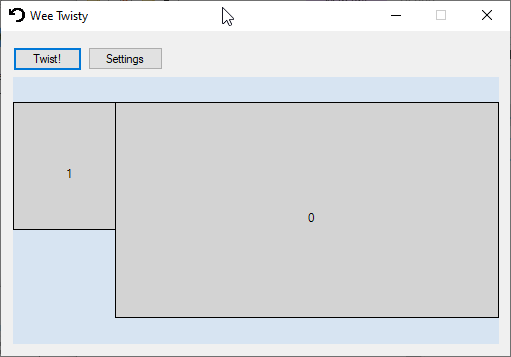

# Lil Twisty #

INCOMPLETE!

Software side of a hardware/software combo to automatically rotate your desktop when you pivot your monitor. Hardware side is a usb gizmo that pretends to be a keyboard, using a tiltswitch. Software is here, listening for special keys and rotating display.

Currently has Win+Shift+F9 and Win+Shift+F10 hardcoded as the global hotkeys to flip the monitor, 
and the monitor rotations are also hardcoded. Obviously it should be able to learn which two
states it should actually flip between (e.g. on my setup it's currently landscape and flipped-portrait, not portrait).

